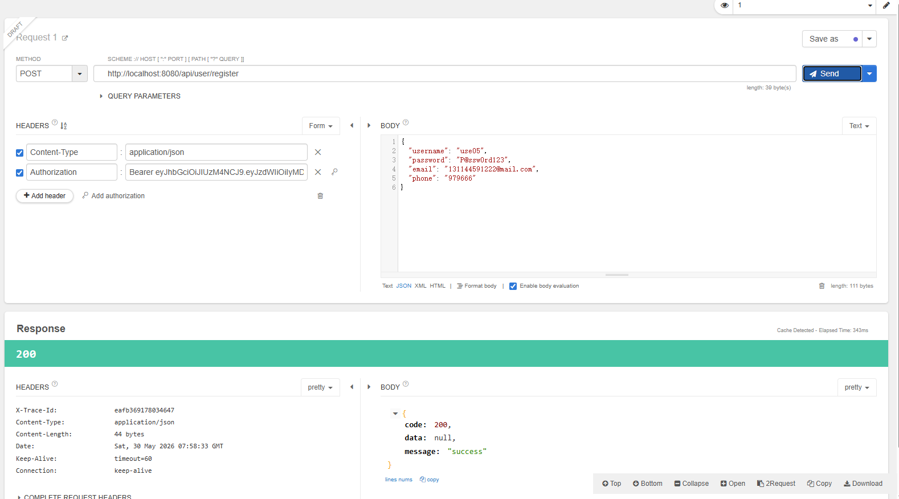
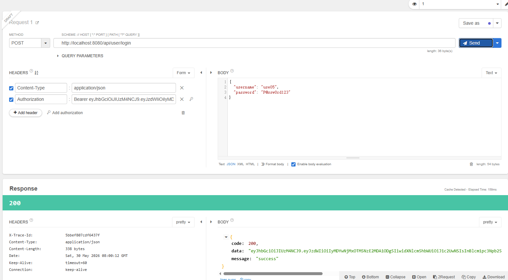
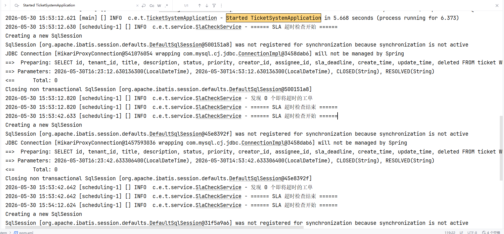
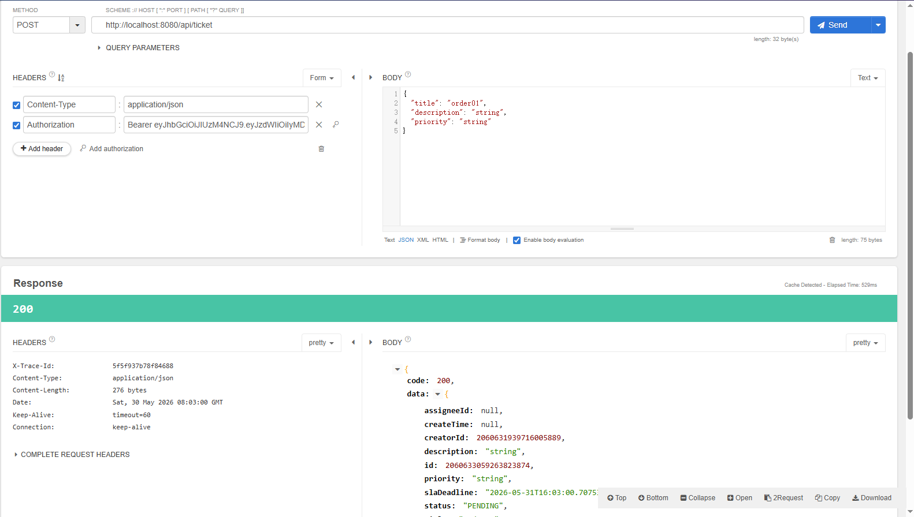
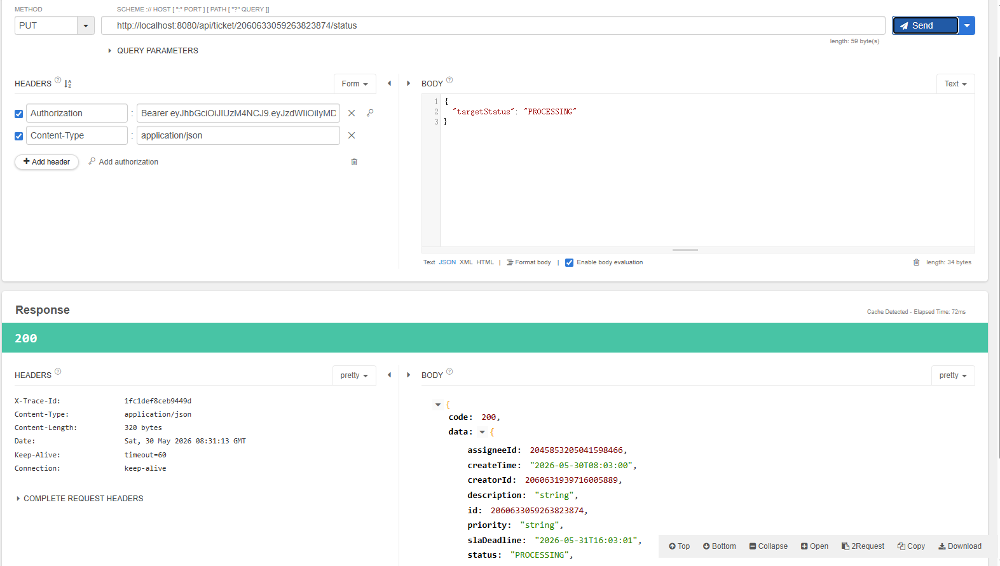
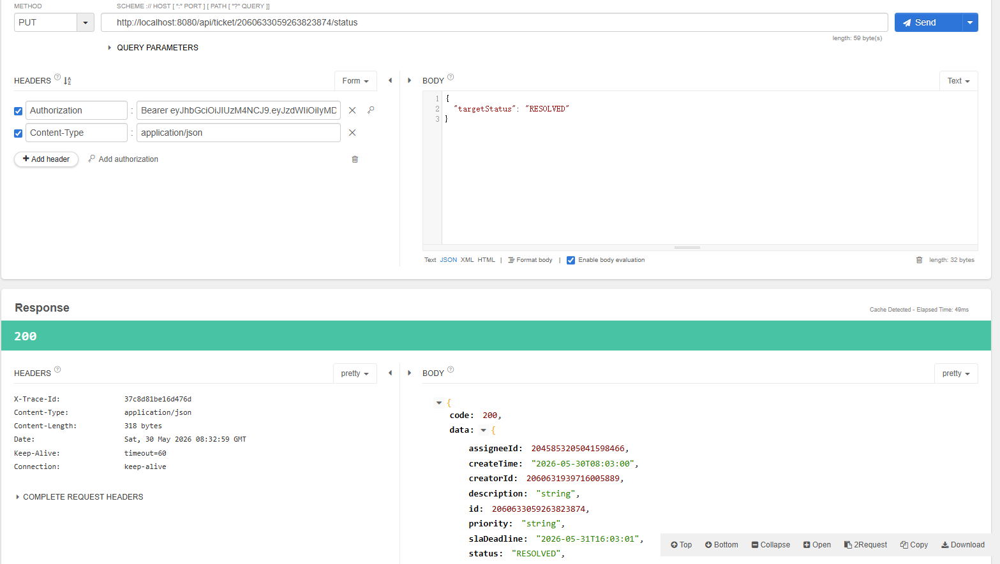
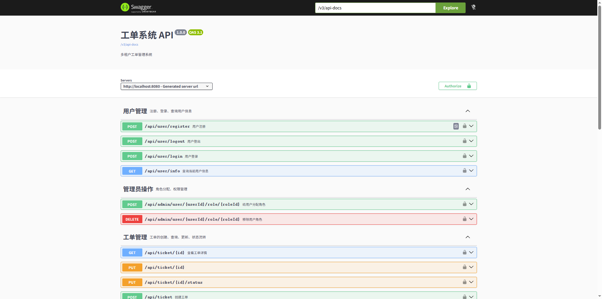
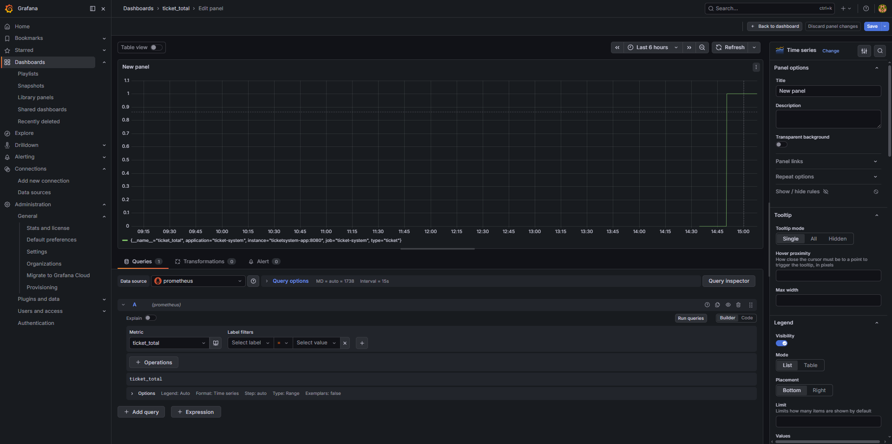

# 🎫 TicketSystem — 多租户工单管理系统

一个基于 Spring Boot 的企业级工单管理系统，涵盖 RBAC 权限、多租户隔离、消息队列异步通知、Redis 缓存等核心能力。

## 项目背景

模拟企业内部工单场景：用户提交工单 → 处理人接单处理 → 状态流转 → 关闭归档。系统支持多租户数据隔离，不同租户的数据互不可见。

## 技术栈

| 层面 | 技术 |
|------|------|
| 框架 | Spring Boot 4.0.x |
| ORM | MyBatis-Plus |
| 数据库 | MySQL 8.0 |
| 缓存 | Redis 7 |
| 消息队列 | RabbitMQ 3 |
| 认证 | JWT（jjwt） |
| 加密 | BCrypt（Spring Security Crypto） |
| 文档 | SpringDoc OpenAPI（Swagger） |
| 数据库版本管理 | Flyway |
| 容器化 | Docker Compose |

## 快速启动

```bash
# 构建并启动全部服务（MySQL + Redis + RabbitMQ + App + Prometheus + Grafana）
docker compose up --build -d

# 查看服务状态
docker compose ps

# 验证应用健康
curl http://localhost:8080/actuator/health
```

启动后访问：

| 服务 | 地址 | 账号 |
|------|------|------|
| Swagger 文档 | http://localhost:8080/swagger-ui/index.html | - |
| Prometheus | http://localhost:9090 | - |
| Grafana | http://localhost:3000 | admin / admin |
| RabbitMQ 管理 | http://localhost:15672 | guest / guest |

运行测试（需先启动 MySQL + Redis + RabbitMQ）：

```bash
docker compose up -d mysql redis rabbitmq
mvn test
```
## 核心设计

### RBAC 权限模型

采用经典的五表模型：用户表、角色表、权限表、用户-角色关联表、角色-权限关联表。

- **管理员**：拥有所有权限，可查看所有工单
- **普通用户**：可创建工单，只能查看自己创建的工单
- **处理人**：可接单和处理，只能查看分配给自己的工单

权限校验通过自定义注解 `@RequiresPermission("ticket:create")` + AOP 切面实现声明式鉴权。权限数据优先从 Redis 缓存读取，缓存未命中时查库并回填，避免每次请求都查数据库。

### 工单状态机

状态流转规则定义在枚举类中，不允许随意修改状态：

```
PENDING（待受理）→ PROCESSING（处理中）    接单
PROCESSING      → RESOLVED（已解决）      解决
PROCESSING      → PENDING                退回
RESOLVED        → CLOSED（已关闭）        关闭
CLOSED          → （终态，不可变更）
```

非法的状态转换会返回明确的错误信息。

### 多租户隔离

使用 MyBatis-Plus 的 `TenantLineInnerInterceptor` 实现逻辑隔离：

- 用户登录时从 JWT 解析 `tenant_id`，存入 `ThreadLocal`
- 拦截器自动为所有 SQL 追加 `WHERE tenant_id = ?` 条件
- 业务代码零侵入，无需手动传递租户参数

### 缓存策略

| 缓存项 | 数据结构 | 更新策略 |
|--------|----------|----------|
| 用户权限 | Redis List | 登录时写入，权限变更时清除 |
| 用户角色 | Redis List | 同上 |
| 工单统计 | Redis Hash | 状态变更时增量更新，定时全量刷新 |

缓存删除失败时通过 RabbitMQ 发送补偿消息，Consumer 重试删除（最多3次），实现最终一致性。

### MQ 异步通知

使用 RabbitMQ Topics 模式：

- **工单创建**：异步通知处理人有新工单
- **状态变更**：异步通知创建人工单进展
- **SLA 超时**：定时任务每5分钟扫描即将超时的工单，发送 MQ 提醒
- **死信队列**：消费失败的消息进入死信队列，避免消息丢失

### 事务管理

工单状态流转使用 `@Transactional(rollbackFor = Exception.class)`，一次操作同时完成：

1. 更新工单状态
2. 记录操作日志
3. 更新统计数据

任何一步失败整体回滚，保证数据一致性。

### 审计日志

通过自定义注解 `@Log` + AOP 切面自动记录关键操作（工单创建、状态变更、权限变更），包含操作人、操作内容、IP 地址、变更前后的值（JSON 格式），便于追溯。

## API 概览

| 模块 | 接口 | 说明 |
|------|------|------|
| 用户 | `POST /api/user/register` | 用户注册 |
| 用户 | `POST /api/user/login` | 用户登录（返回 JWT） |
| 用户 | `GET /api/user/info` | 查询当前用户信息 |
| 工单 | `POST /api/ticket` | 创建工单 |
| 工单 | `GET /api/ticket/{id}` | 查看工单详情 |
| 工单 | `GET /api/ticket/list` | 工单列表（数据权限过滤） |
| 工单 | `PUT /api/ticket/{id}` | 更新工单 |
| 工单 | `PUT /api/ticket/{id}/status` | 工单状态流转 |
| 工单 | `GET /api/ticket/stats` | 工单统计 |
| 报表 | `GET /api/report/ticket` | 工单报表（管理员） |

完整文档启动后访问：http://localhost:8080/swagger-ui/index.html

## 项目结构

```
com.example.ticketsystem
├── common/                 # 公共组件
│   ├── Result.java              # 统一返回格式
│   ├── BusinessException.java   # 业务异常
│   ├── GlobalExceptionHandler   # 全局异常处理
│   ├── RequiresPermission.java  # 权限注解
│   ├── Log.java                 # 审计日志注解
│   └── TenantContext.java       # 租户上下文（ThreadLocal）
├── config/                 # 配置类
│   ├── JwtUtils.java            # JWT 工具
│   ├── JwtInterceptor.java      # JWT 拦截器
│   ├── WebConfig.java           # Web 配置
│   ├── MybatisPlusConfig.java   # MyBatis-Plus + 租户拦截器
│   ├── RabbitMQConfig.java      # RabbitMQ 配置
│   ├── PermissionAspect.java    # 权限 AOP 切面
│   ├── AuditLogAspect.java      # 审计日志 AOP 切面
│   └── PermissionCacheService   # 权限 Redis 缓存
├── controller/             # 接口层
├── service/                # 业务层
│   ├── impl/                    # Service 实现
│   ├── MessageProducer.java     # MQ 生产者
│   ├── MessageConsumer.java     # MQ 消费者
│   └── SlaCheckService.java     # SLA 定时检查
├── mapper/                 # 数据访问层
├── entity/                 # 数据库实体
└── dto/                    # 数据传输对象
```

## 数据库设计

共 11 张表：

- `sys_user` — 用户表
- `sys_role` — 角色表
- `sys_permission` — 权限表
- `sys_user_role` — 用户角色关联
- `sys_role_permission` — 角色权限关联
- `sys_tenant` — 租户表
- `ticket` — 工单表
- `ticket_stats` — 工单统计
- `operation_log` — 操作日志
- `sys_audit_log` — 审计日志
- `flyway_schema_history` — Flyway 版本记录


# 截图
## 用户注册登录




## 日志



## 订单流转





## Swagger



## Dashboard


